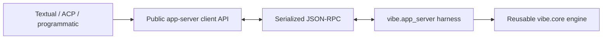

# 0009 App Server as the Harness Boundary

## Decision

`vibe.app_server` is Vibe's harness and the only runtime boundary used by
delivery surfaces. It owns live sessions and composes reusable engine
implementations from `vibe.core`. Textual, ACP, and programmatic mode are
clients of its typed JSON-RPC 2.0 protocol.

Delivery surfaces never construct, receive, or inspect an `AgentLoop`. The
client and server exchange serialized JSON values, including when both run in
one Python process.

`vibe.core` and `vibe.app_server` are source-module boundaries, not peer
services. Core owns surface-neutral model and tool execution. The app server
owns cross-surface session, turn, callback, resource, persistence-access, and
cleanup lifecycles.

Related decisions:

- event-driven engine execution: [0003](0003-event-driven-agent-loop.md);
- tools, permissions, effects, and client-hosted I/O:
  [0004](0004-typed-permissioned-tools.md);
- configuration ownership: [0005](0005-layered-configuration.md);
- private session storage and public session state:
  [0006](0006-local-sessions.md); and
- agents, subagents, skills, hooks, MCP, and connectors:
  [0007](0007-extension-mechanisms.md).

## Rationale

Vibe serves several delivery surfaces with one engine. A real serialized
boundary gives the runtime one owner, prevents UI and protocol adapters from
depending on Python object identity, and lets every surface observe the same
turn, callback, effect, resource, and cleanup semantics.

Public projections deliberately differ from private runtime and storage state.
That keeps secrets and implementation details server-side while giving clients
stable values they can reduce, render, page, and recover after an event gap.

## Ownership

The server is authoritative for state that can affect the model, workspace,
session durability, or shared runtime:

| Server or harness ownership | Client ownership |
| --- | --- |
| Root and child runtime construction | Widgets and layout |
| Session identity, turns, and execution reservations | Keyboard and prompt editing |
| Private session storage and public projections | Rendering public models |
| Canonical cwd, workspace roots, trust, and prompt preparation | Display aliases and autocomplete presentation |
| Effective config, persistence, agents, and model selection | Applying an accepted theme |
| Tools, permissions, effects, and model-visible results | Clipboard integration |
| Skills, hooks, MCP, connectors, and subagents | Microphone, speaker, recording, and playback |
| Scheduled loops, shell effects, reviews, and integrations | Advertised client-hosted filesystem or terminal calls |
| Account, feedback, telemetry, diagnostics, and cleanup | Other explicitly client-local presentation services |

Client-hosted filesystem or terminal execution, for tools that support it, is a
capability rather than a transfer of harness ownership. The server still
validates the tool, resolves permission, orchestrates execution, projects one
public effect, and supplies the result to the model.

Persisted settings remain server-owned even when the client applies their
accepted value to local hardware or presentation.

## Package and dependency boundaries

The dependency direction is strict:

- `vibe.core` does not import `vibe.app_server`, Textual, or ACP protocol types.
- Private server modules under `vibe.app_server` may import core implementations
  because they compose and project them.
- Public models, protocol envelopes, transports, client facades, client state,
  and reducers do not import `vibe.core`.
- Attached runtime code in `vibe.cli`, `vibe.acp`, and programmatic mode uses
  public app-server facades. Feature code must not import private app-server
  modules.
- `vibe.app_server._runtime` is the construction boundary for `AgentLoop`.
  Delivery surfaces pass serialized launch intent, not prebuilt core objects.

Launcher, setup, and authentication code still performs pre-session bootstrap
before a runtime is attached. That code may load startup configuration, but it
must not own or mutate the live attached runtime or its config.

Production code under `vibe/cli/textual_ui` has no core imports and no
`agent_loop` references, including through helper modules.

The public package exports a narrow client API:

- `AppServerHost` for passive pre-session operations and opening a session;
- `AppServerSession` for an attached session, turns, resources, and live events;
- `ClientToolHandler` for explicitly advertised client-hosted operations; and
- `SessionExitSummary` for delivery-surface shutdown presentation.

### Type ownership

There is one definition for each public concept:

- `vibe.app_server.models` owns public session, history, callback, effect, and
  shared resource values;
- focused modules such as `vibe.app_server.config` own redacted public views;
- `vibe.app_server.protocol` owns request, response, error, and notification
  envelopes and imports the public values; and
- client events wrap those public values without redefining their fields.

A public model is separate from a core model only when it is intentionally
redacted, aggregated, transport-oriented, or has a different lifecycle.
Translation belongs in server-only projectors and handlers. Identical concepts
use one dependency-neutral definition rather than parallel model hierarchies.

`ProtocolModel` defines strict camel-case serialization and rejects unknown
fields. It is a serialization policy, not a second domain type system.

The app server reuses core config, session storage, agent management, tools,
permissions, skills, hooks, MCP, connectors, and utilities. It must not grow
shadow managers, parallel persistence, copied config schemas, or untyped
reconstruction of core events.

## Serialized protocol lifecycle

The implemented transports are serialized in-process queues and newline-
delimited stdio. Both pass through the same JSON-RPC client, server, models, and
handlers. In-process calls are not allowed to bypass serialization.

Both transports use bounded queues. Stdio has one writer that preserves message
order and applies backpressure. In stdio mode, stdout is reserved for JSON-RPC;
human logs use the configured log file or stderr.

### Initialization and attachment

Every connection follows this order:

1. The client sends `initialize` with `ClientInfo` and capabilities.
2. The server returns its identity, protocol version, methods, callback kinds,
   and transports.
3. The client sends `initialized`.
4. Passive host requests may run without a live root runtime.
5. `session/start`, `session/resume`, or `session/continue` lazily creates or
   loads the root runtime and attaches the connection.
6. The client reads the canonical runtime snapshot and consumes live events.

No ordinary request is accepted before initialization. Initialization occurs
once per connection. Creating a server does not eagerly create an agent runtime
or load a workspace session.

`AppServerHost` supports passive session list/read/history/delete, config-schema,
and workspace-trust operations. Opening a session transfers that connection to
`AppServerSession`; the same facade is not both a passive host and an attached
runtime client.

One `AppServer` instance owns one attached root runtime and its child-session
registry. The protocol does not currently model several simultaneous attached
observers of one runtime.

### Message directions

The protocol has three explicit directions:

1. Clients send typed requests for session actions and resource operations.
2. The server sends typed notifications for public state and resource changes.
3. The server sends typed requests when it needs client participation:
   `callback/call` and advertised `clientTool/*` operations.

The response to `callback/call` acknowledges delivery only. The semantic answer
always returns in a client-to-server `callback/respond` request. Client-tool
responses carry the result of the requested filesystem or terminal operation.

Methods are explicit and typed. There is no generic slash-command execution,
`executeCommand`, or generic session-event request. The current method catalogue
is `vibe.app_server.protocol.SERVER_METHODS`; its Pydantic parameter and result
models are the source of truth.

Accepted actions write their response before notifications caused by that
action. Attach operations establish the returned snapshot and live event route
as one lifecycle transition so accepted events are not lost between them.

## Sessions and turns

Session creation and user execution are separate:

- `session/start` creates and attaches an empty session;
- `session/resume` loads saved state and attaches it;
- `session/continue` resolves and attaches the latest eligible session;
- `session/read`, `session/list`, and `session/history/list` are passive reads;
- `session/fork` creates a session from an existing public boundary;
- `session/stop` flushes and shuts down the attached runtime;
- `turn/start` begins structured user input and may mark harness instructions as
  injected so they remain hidden from public history;
- `turn/steer` adds input to the active turn; and
- `turn/interrupt` interrupts the active turn.

A session has at most one active turn. Steering and interruption include the
expected turn identity so stale control requests fail instead of affecting a
new turn.

Turn input is structured content. The server owns normalization into
model-visible input and persistence. Delivery surfaces do not construct private
messages or maintain a second prompt renderer.

Compaction preserves the active session identity and appends a checkpoint to the
same public history. Plan-context clearing may replace the active session while
preserving the turn. For replacement operations, the server emits a typed
handoff containing the old ID, replacement `PublicSessionState`, event
watermark, and session-log summary. The client adopts all of those values
atomically before processing later events.

Root creation and replacement are serialized lifecycle transitions. A staged
replacement is either adopted after the previous root closes or is itself
closed on failure; requests never observe two authoritative roots or a
half-replaced runtime.

Derived runtimes, including forks and child sessions, inherit experiment state
before deferred tool discovery or system-prompt rendering begins. Tool
availability and prompt instructions therefore come from the same experiment
assignment from the first rendered prompt.

## Public state and event reduction

`PublicSessionState` is a lossy, renderable projection. It contains:

- a format identifier and per-session event watermark;
- public session metadata;
- a page of public history;
- currently open callback entries; and
- the active or most recently terminal turn.

It is not the private persistence format and is not sufficient to reconstruct
the engine. Only the server reads session files.

Within a session, public history is an append-only timeline of these closed
variants:

- message;
- reasoning;
- effect;
- callback;
- checkpoint; and
- notice.

Entries have stable IDs and generation status. An in-progress entry may receive
typed patches. A completed entry is immutable. Compaction appends a checkpoint
without replacing the session. Rewind and clear may create a replacement session
derived from an earlier boundary plus a checkpoint. The original stored session
is not rewritten, and the client adopts the returned replacement snapshot rather
than editing its existing projection.

One effect entry owns the complete visible lifecycle of work: call, streaming
output, approval blocking, result, duration, and terminal state. Tool names are
data, not app-server dispatch keys. Semantic presentation kinds enable bounded
rich renderers, and arbitrary tools use a generic effect fallback.

Core engine events remain canonical inside the server. The app server consumes
their async stream and projects only client-relevant semantics. It does not
mirror every core event into a second private hierarchy.

Projection-changing notifications carry a positive, monotonic event ID scoped
to one loaded session runtime. A restored runtime may begin a new sequence and
its subscription snapshot replaces the earlier projection and watermark. A
subscription never promises replay of events from an earlier connection or
process. The snapshot's `eventId` is its watermark. The client reducer:

1. ignores IDs at or below the watermark;
2. accepts only the next ID;
3. treats a larger ID as a gap; and
4. recovers by replacing state from `session/read` and reconciling public events.

The core notification families are `session/snapshot`, session handoffs,
`session/updated`, `history/entryAdded`, `history/entryUpdated`,
`turn/started`, `turn/completed`, and `session/statsUpdated`. Warnings, errors,
and resource notifications remain typed rather than using a generic envelope.

## Callbacks and client participation

Approvals and user questions originate as typed core request events with stable
request IDs. The server projects them as callback history entries and related
effect state. Neither Textual nor the app server installs callback functions,
message observers, or listeners on `AgentLoop`.

The live callback lifecycle is:

1. record the open callback in the public session projection;
2. mark the related effect and session as blocked when applicable;
3. send `callback/call` to a client that advertised the callback kind;
4. receive delivery acknowledgement;
5. accept the semantic result through `callback/respond`;
6. resolve the original core request exactly once; and
7. complete or cancel the callback and related effect.

An identical semantic response retry is a duplicate no-op. A conflicting second
response is rejected. Open callbacks remain visible in `activeCallbacks` and
are re-delivered when a connection resumes the same live runtime.

Client-hosted tool I/O follows the same explicit participation rule. The client
advertises filesystem and/or terminal capability during initialization. The
server adapts those requests through `ToolIOPort`; unsupported operations fail
instead of silently switching ownership or implementation.

## Server-owned resources

State outside the main timeline uses typed resource families. Live-session
configuration mutations such as agent switching, settings updates, config
writes, and config reloads are applied through the selected session backend;
the app server remains responsible for their typed Host API and public result.
Current resource families
include runtime/config, agents, skills, tools, MCP, connectors, diagnostics,
statistics, session logs, scheduled loops, workspace trust and prompt
preparation, account, feedback, narration, review, telemetry, shell, and Vibe
Code operations.

The client receives public views, not managers or registries. Mutations return
authoritative results. When a change affects several derived views,
`runtime/updated` carries one canonical `RuntimeSnapshot`; clients replace their
cached config, agents, tools, skills, hook count, MCP, connectors, config issues,
and statistics together.

Slash commands are presentation affordances over these resources. Client-only
commands may change presentation locally. Any command that changes session,
workspace, model-visible, persisted, or integration state calls an explicit
app-server resource method.

## Subagents and child sessions

Subagents are server-owned child sessions. Each child has its own session ID,
runtime, and public projection. The parent exposes a subagent effect containing
the child session ID; it does not embed the child's runtime or history. The
parent-child link is persisted when session logging is enabled.

The server registry routes child events and lifecycle operations. Child
execution uses the server-owned `ToolIOPort`, including client-hosted I/O when
advertised. Clients may read a child session by ID and render a tree, but they
do not construct child loops, reduce child core events, or duplicate subagent
result handling.

## Delivery adapters

Textual, ACP, and programmatic mode share the same app-server session and
resource APIs:

- Textual renders public models and owns terminal-local facilities.
- ACP translates ACP requests, callbacks, content, client tools, and updates to
  and from the app-server API.
- Programmatic mode starts turns and consumes the same public event stream
  without depending on Textual.

No attached delivery-surface runtime owns a parallel agent loop, config manager,
session loader, tool execution path, or extension lifecycle.

## Reconnect, shutdown, and security

The in-process harness can replace a failed memory connection. The client
initializes the new connection, resumes the attached session, replaces its
projection from the returned snapshot, and receives still-open callbacks. Stdio
EOF closes its server process; process restart uses normal persisted-session
resume semantics and does not imply restoration of in-flight execution.

Transport detachment only removes that connection's subscriptions and callback
claims. A successful `session/stop` is the delivery surface's durability and
runtime-cleanup boundary. The server records eligible last-session state,
flushes session-owned data, closes child runtimes, interrupts or rejects pending
work, and releases owned runtime resources such as MCP clients, model backends,
experiments, managed terminals, Vibe Code operations, and telemetry before
shutdown finishes.

Security rules:

- the server enforces tool, workspace, network, MCP, and connector policy;
- public rendering metadata cannot grant permission;
- public projections redact secrets, credentials, model context, and unsafe
  internal errors;
- config views expose environment variable names, not resolved values;
- workspace and tool policy is enforced server-side where applicable;
- callback and client-tool results are validated before runtime state changes;
  and
- unknown methods, fields, variants, notifications, or unsolicited responses
  fail explicitly.

## Consequences

- Interactive startup constructs the harness behind `vibe.app_server`; Textual
  receives only client-facing services.
- Session files and private config objects are never read by Textual.
- Agent, model, permission, config, MCP, connector, skill, hook, and subagent
  changes are server operations.
- ACP and programmatic mode do not maintain parallel runtime implementations.
- Public models and private core types may differ only for a real semantic
  boundary.
- A feature is not migrated merely because an RPC wrapper exists. Ownership,
  persistence, projection, cleanup, reconnect behavior, and tests must all sit
  on the correct side.

## Agent Guidance

- Start changes from the owning app-server resource or session facade, not from
  a Textual widget's access to core state.
- Add explicit typed methods and models. Do not add generic command or event
  payloads.
- Consume core events in server-only projectors. Do not reconstruct core events
  from strings or dictionaries in the client.
- Keep one public definition for each concept and one server-only translation
  point where semantics differ.
- Keep arbitrary tool support generic; rich rendering is keyed by bounded
  semantic presentation kinds.
- Preserve monotonic event sequencing, immutable completed entries, and
  response-before-notification ordering.
- Treat callbacks and client tools as explicit server-to-client requests with
  validated response lifecycles.
- Return or notify canonical resource state after mutations rather than
  maintaining client/server shadow state.
- Keep blocking serialization, file I/O, subprocess work, and discovery off the
  shared UI event loop.

## Flag To User When

- A delivery surface needs a live `AgentLoop`, manager, registry, config object,
  or session loader.
- A change introduces a second runtime, persistence path, reducer, or extension
  lifecycle.
- A new public type is field-for-field identical to an existing
  dependency-neutral type.
- A new tool requires dispatch by tool name instead of the generic effect path.
- A server-owned mutation has no explicit typed method or cannot return an
  authoritative public result.
- A feature assumes multiple attached clients, a new transport, or persistence
  of in-flight execution that the current implementation does not provide.

## Enforcement

Existing boundary and protocol tests guard these representative invariants and
must remain in place as the architecture evolves:

- Textual has no core imports or `agent_loop` references;
- only the server runtime composition constructs `AgentLoop`;
- memory and stdio use the same serialized protocol models;
- initialization precedes other requests and runtime creation is lazy;
- unknown protocol shapes fail strictly;
- public event IDs are monotonic and gaps trigger snapshot recovery;
- completed entries cannot be patched and one effect spans the full lifecycle;
- callback delivery and semantic response are separate and resolve core requests
  once;
- reconnect re-adopts a snapshot and open callbacks;
- session handoffs atomically replace identity and projection;
- derived runtimes hydrate inherited experiments before deferred initialization;
- child callbacks, client-hosted I/O, result projection, and cleanup remain
  server-routed; and
- root and child cleanup attempts all owned runtimes even when one cleanup
  fails.

The architecture boundary suite lives under
`tests/cli/textual_ui/test_app_server_boundary.py`, with protocol, event,
session, callback, transport, resource, ACP, and programmatic behavior covered
by focused tests under `tests/app_server`, `tests/acp`, and `tests`.
